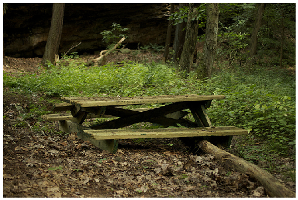

# Visual Question Answering
Pytorch implementation of the following papers: 
* VQA: Visual Question Answering (https://arxiv.org/pdf/1505.00468.pdf).
* Making the V in VQA Matter: Elevating the Role of Image Understanding in Visual Question Answering
  (https://arxiv.org/pdf/1612.00837.pdf)

## Results
The table shows that the performance of our implementation and original paper. 

|  | All | Yes/No | Number | Other |
| ------ | ------ | ------ | ------ | ------ |
| Implement | 49.15% | 67.42% | 32.44% | 37.28% |
| Original Paper | 54.22% | 73.46% | 35.18% | 41.38% |

Here is the example of VQA task:<br>
 

What is behind the bench ?

* Answer 1: trees
* Answer 2: grass
* Answer 3: forest
* Answer 4: brush
* Answer 5: leafs
* Answer 6: trees
* Answer 7: plants
* Answer 8: grass
* Answer 9: trees
* Answer 10: brush

Generated Answer: trees (90%)
## Dataset
VQA v2.0 release
- Real 
	- 82,783 MS COCO training images, 40,504 MS COCO validation images and 81,434 MS COCO testing images 
	- 443,757 questions for training, 214,354 questions for validation and 447,793 questions for testing
	- 4,437,570 answers for training and 2,143,540 answers for validation (10 per question)

There is only one type of task
- Open-ended task
## Usage
#### 1. Clone the repository
```
git clone https://github.com/ntusteeian/VQA_CNN-LSTM.git
```
#### 2. Download the VQA v2.0 from official website https://visualqa.org/download.html
#### 3. Preprocessing input data (images, questions, answers)
```
python preprocess/resize_images.py
python preprocess/make_vocab.py
python preprocess/preprocessing.py
```
#### 4. Train the model
```
python model/train.py 
```
#### 5. Test model and build the result json file
```
python model/test.py
```
#### 6. Clone the repository for evaluation (forked from official and changed syntaxs to python3)
```
git clone https://github.com/ntusteeian/VQA_evaluation.git
``` 
#### 7. Get evaluation results for open-ended task
```
python vqaEvalDemo.py
```
## Reference
Evaluation code: https://github.com/GT-Vision-Lab/VQA
